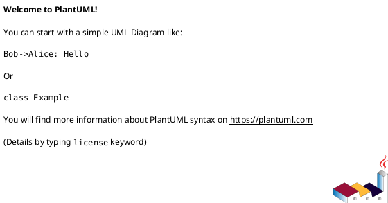

# Technical Design Specification: HP Pro 8600 Firmware Downgrade Toolkit

## 1. Executive Overview & Technological Strategy

This document details the software architecture, technical interfaces, technology stack, data schemas, and implementation choices for the HP OfficeJet Pro 8600 Firmware Downgrade Toolkit. Derived directly from `CONCEPT.md`, this specification provides the exact technical baseline required to build a reliable, cross-platform CLI and REST-enabled toolkit for restoring legacy firmware on HP OfficeJet Pro 8600 series printers (N911a, N911g, N911n).

---

## 2. Tech Stack & Engineering Environment

### 2.1 Core Language & Runtime
- **Programming Language:** Python 3.11+
  - *Rationale:* Native support for asynchronous I/O, cross-platform socket and USB handling, rich standard library, and high maintainability for network protocol parsing.

### 2.2 Frameworks & Libraries
- **CLI Framework:** `Click` 8.1+ with `rich` for formatted terminal output.
  - All command line options support both short (e.g. `-d`) and long (e.g. `--device`) flags.
- **REST API Framework:** `FastAPI` 0.100+ with `uvicorn` ASGI server.
  - Automatically generates OpenAPI 3.0 schema synchronized to `api/openapi.yaml`.
- **Data Validation & Serialization:** `Pydantic` v2.
- **Low-Level I/O & Networking:**
  - `asyncio` + `socket` for raw socket communication (TCP port 9100 PJL stream).
  - `pyusb` / `libusb` for direct USB channel communication.
- **Testing & Quality Assurance:**
  - `pytest`, `pytest-asyncio`, `pytest-cov`, `httpx` (API integration tests), `mypy` (static typing), `flake8` (linting).

---

## 3. Detailed Architecture & Technical Interfaces

### 3.1 System Overview
``

```
+-----------------------------------------------------------------------------------+
|                                 USER INTERFACE                                    |
|   +---------------------------------------+   +-------------------------------+   |
|   |           CLI Application             |   |       FastAPI REST Service    |   |
|   |        (Click + Rich Output)          |   |      (api/openapi.yaml)       |   |
|   +-------------------+-------------------+   +---------------+---------------+   |
+-----------------------|-----------------------------------|-----------------------+
                        |                                   |
                        v                                   v
+-----------------------------------------------------------------------------------+
|                               CORE TOOLKIT ENGINE                                 |
|                                                                                   |
|  +---------------------------+                   +-----------------------------+  |
|  |   Diagnostics & Discovery |                   |    Firmware Asset Vault    |  |
|  |   Module (SNMP/PJL/USB)   |                   |    Module (SHA-256/RFU)     |  |
|  +-------------+-------------+                   +--------------+--------------+  |
|                |                                                |                 |
|                +-----------------------+------------------------+                 |
|                                        |                                          |
|                                        v                                          |
|                          +---------------------------+                            |
|                          |     Firmware Flasher      |                            |
|                          |   & Protocol Adapter      |                            |
|                          |    (PJL Encapsulation)    |                            |
|                          +-------------+-------------+                            |
|                                        |                                          |
|                                        v                                          |
|                          +---------------------------+                            |
|                          |  Update Protection Shield |                            |
|                          |  (EWS / Web Services Off) |                            |
|                          +---------------------------+                            |
+----------------------------------------+------------------------------------------+
                                         |
                                         v
+-----------------------------------------------------------------------------------+
|                          PRINTER HARDWARE (HP PRO 8600)                           |
|                      (TCP Socket Port 9100 / USB Direct)                          |
+-----------------------------------------------------------------------------------+
```

---

### 3.2 Component Specifications

#### 3.2.1 Discovery & Diagnostics Module (`src/toolkit/diagnostics.py`)
- **Responsibilities:**
  - Discovers network-attached printers via UDP SNMP (OID `.1.3.6.1.2.1.1.1.0`), mDNS/Bonjour (`_pdl-datastream._tcp`), and direct PJL socket probes on TCP port 9100.
  - Discovers USB-connected devices using USB Vendor ID `0x03F0` (HP Inc.) and Product IDs corresponding to N911 series.
  - Queries device status, exact model string, firmware revision build date, serial number, and dynamic security cartridge lock state using PJL `@PJL INFO ID` and `@PJL INFO CONFIG` queries.

#### 3.2.2 Firmware Asset Vault Module (`src/toolkit/vault.py`)
- **Responsibilities:**
  - Stores and indexes verified legacy firmware images (`.rfu` / `.ful` format) for HP OfficeJet Pro 8600 models:
    - `N911a` (Basic Model)
    - `N911g` (Plus Model)
    - `N911n` (Premium Model)
  - Enforces cryptographic SHA-256 checksum checks before any file operation.
  - Validates file headers for PJL magic markers (`\x1b%-12345X@PJL JOB`) to prevent flashing invalid or corrupt binaries.

#### 3.2.3 Firmware Flasher & Protocol Adapter (`src/toolkit/flasher.py`)
- **Responsibilities:**
  - Wraps legacy firmware binary payloads into HP Printer Job Language (PJL) transmission envelopes:
    ```pjl
    \x1b%-12345X@PJL
    @PJL JOB NAME = "FIRMWARE_FLASHER"
    @PJL ENTER LANGUAGE = POSTSCRIPT
    <RAW_FIRMWARE_BINARY_PAYLOAD>
    \x1b%-12345X@PJL EOJ
    \x1b%-12345X
    ```
  - Streams payload in 64 KB chunk buffers with real-time progress callbacks and error detection.
  - Performs post-flash reboot verification polling to confirm successful downgrade.

#### 3.2.4 Update Protection Shield Module (`src/toolkit/shield.py`)
- **Responsibilities:**
  - Reconfigures device settings to block automatic firmware updates and cloud re-flashing:
    - Sends PJL / SNMP set requests to disable automatic update checking (`@PJL SET AUTOUPDATE = OFF`).
    - Disables HP Web Services / ePrint endpoints via Embedded Web Server (EWS) internal configuration calls.

---

## 4. Interface Definitions

### 4.1 Command-Line Interface (CLI)

All CLI flags adhere strictly to dual short and long form syntax (`-short` / `--long`).

#### Command Structure
```bash
# Scan network/USB for target HP 8600 devices
hp8600-toolkit scan [-i|--interface <iface>] [-t|--timeout <seconds>] [-o|--output json|text]

# Run diagnostic check on specific printer
hp8600-toolkit inspect -d|--device <ip_or_usb_id> [-p|--port <port>] [-v|--verbose]

# Downgrade device firmware
hp8600-toolkit flash -d|--device <ip_or_usb_id> -f|--firmware <fw_id_or_path> [-p|--port <port>] [-y|--yes]

# Apply update lockdown shield
hp8600-toolkit shield -d|--device <ip_or_usb_id> -m|--mode disable|enable [-p|--port <port>]

# Manage local firmware vault
hp8600-toolkit vault list [-m|--model <model_id>]
hp8600-toolkit vault verify -f|--file <path_to_rfu>
```

---

### 4.2 REST API Specification

The REST API is documented in `api/openapi.yaml` and conforms to OpenAPI 3.0.

#### Summary of Endpoints

| Method | Endpoint | Description | Request Body / Params | Response |
| :--- | :--- | :--- | :--- | :--- |
| `GET` | `/api/v1/devices` | Scan for HP 8600 devices | `timeout` (int), `interface` (str) | `200 OK` List of `Device` objects |
| `GET` | `/api/v1/devices/{device_id}` | Inspect device diagnostics | Path: `device_id` | `200 OK` `DeviceDiagnostics` object |
| `GET` | `/api/v1/vault/firmware` | List stored firmware binaries | `model` (optional str) | `200 OK` List of `FirmwareMetadata` |
| `POST` | `/api/v1/flash` | Trigger firmware downgrade | `FlashRequest` JSON | `202 Accepted` `JobStatus` object |
| `GET` | `/api/v1/flash/jobs/{job_id}` | Poll flash job progress | Path: `job_id` | `200 OK` `FlashJobProgress` object |
| `POST` | `/api/v1/shield` | Configure update lockdown | `ShieldRequest` JSON | `200 OK` `ShieldResult` object |

---

### 4.3 Data Schemas & Database Entities

While the primary vault operates on verified file systems, local job states and audit logs utilize an embedded SQLite database (using standard ANSI SQL dialect).

#### Entity Relationship Schematic (PlantUML Crowfoot)



---

## 5. Major Technological Choice Evaluations & Discarded Alternatives

To establish a resilient and maintainable architecture, three major technical choices were evaluated, comparing three distinct options for each choice.

### Choice 1: Core Programming Language & Runtime
* **Alternative A (Chosen): Python 3.11+ (Asyncio, Socket, Click, FastAPI)**
  - *Rationale:* Excellent cross-platform networking library support, fast prototyping, robust asynchronous socket handling, low barriers for open-source contributors, and rich ecosystem for CLI and Web REST APIs.
* **Alternative B: Rust (Tokio, Axum, Clap)**
  - *Discarded Rationale:* Higher implementation complexity for socket streaming and string manipulations, steeper learning curve, and slower compilation cycles during development.
* **Alternative C: Node.js / TypeScript (Express, Commander)**
  - *Discarded Rationale:* Larger runtime memory usage, complex dependency tree (node_modules vulnerability risk), and potential USB native addon compilation issues across varied host OS environments.

### Choice 2: REST API Framework & Schema Generation
* **Alternative A (Chosen): FastAPI with Automatic OpenAPI 3.0 Generation**
  - *Rationale:* Native support for asynchronous handlers, integrated type validation using Pydantic, automatic OpenAPI schema export (`api/openapi.yaml`), and minimal boilerplate.
* **Alternative B: Flask with Flasgger / Marshmallow**
  - *Discarded Rationale:* Requires manual swagger schema syncing, lacks native async socket polling efficiency, and relies on external plugins for serialization.
* **Alternative C: Go Net/HTTP with Gin Framework**
  - *Discarded Rationale:* Requires maintaining two separate language codebases (Python/Go) if Python is used for CLI or scripting, increasing project fragmentation.

### Choice 3: Firmware Storage & Integrity Verification
* **Alternative A (Chosen): Local Asset Vault with Enforced SHA-256 Validation & Manifest File**
  - *Rationale:* Guarantees offline operational capability, total immunity to remote host outages or takedown notices, and strict binary checksum verification before transmission.
* **Alternative B: SQLite Blob Storage for Binary Assets**
  - *Discarded Rationale:* Unnecessarily increases database file size, complicates chunked streaming to sockets, and makes binary inspection harder.
* **Alternative C: Dynamic Remote S3 Download on Demand**
  - *Discarded Rationale:* Introduces remote network dependency, risk of broken links, and security vulnerabilities if external hosting is compromised.
